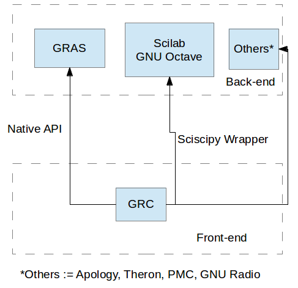

## Code Development

### Disruptive introduction to framework

This section is intended to be a quick introduction to architecture of Sandhi without getting into unnecessary details.

#### Sandhi Architecture
Sandhi is fork of GRAS(GNU Radio Advanced Scheduler) at core, but it also incorporates other modules like Sciscipy etc.
<br>
[GRAS](https://github.com/guruofquality/gras) is the application scheduler of Sandhi. It enables Sandhi to have closed-loop flowgraphs, dispatch threads, handle thread synchronization and much more.<br>
To know more, checkout it's [wiki](https://github.com/guruofquality/gras/wiki)

Essence of open-source development is to reuse the existing code and to build on top of it; several programs are generally written in high level programming languages such as Scilab/GNU-Octave since-
* It is easier to develop programs on them.
* Lot of libraries or toolboxes are availabe for such languages, which reduces the work.<br>
Hence, Sandhi provides a way to reuse **Scilab** programs as functional blocks through a wrapper called _Sciscipy_. Sciscipy is essentially a wrapper written in C language to provide a mechanism to call Scilab's computational engine through Python while taking care of datatype conversion. <br>
To know more, here's link to it's [official page](http://forge.scilab.org/index.php/p/sciscipy/)

#### Sandhi Interface
Sandhi uses GNU Radio (GR) V3.6 with GNU Radio Companion(GRC) as its front-end. [GNU Radio](http://gnuradio.org/redmine/projects/gnuradio/wiki) is open source software for implementing software radio visually through flowgraphs and blocks. A flow graph in GNU Radio is visual representation of data flow between two or more nodes, and these nodes are called blocks (which process the flowing data). Sandhi inherits this capability of intuitively implementing logic through flowgraph which makes it a good LabVIEW replacement.

### Coding a simple block
Since sandhi is still in beta stages, some of user-specific block may be missing; but this is not really a problem, since a user with limited python experience can create block himself/herself using Sandhi's framework. To follow a descriptive, step-by-step and conventional guide check GNU Radio's [Out of Tree Module](http://gnuradio.org/redmine/projects/gnuradio/wiki/OutOfTreeModules). A block can be either coded in python or C++; but given python is easier to start with, we prefer coding in python. This section will present a rapid but unconventional approach: _impatience is virtue_

#### Overview
A block in Sandhi essentially requires two things:

1. A xml file (front end block description which is parsed by GRC to display that block.)
2. A python file (which describes how the block functions.)

Sandhi, by default, reads any xml block present in ~/.grc_gnuradio. Hence all our initial development will be done in the .grc_gnuradio folder.

#### Sample code
Sample code is availabe with annotations [here](code/.grc_gnuradio/)

#### Integrating block with Sandhi
We'd be pleased to include your block if it suits a majority of Sandhi-users; so to include your block with Sandhi either:

1. Send us a pull request of your block, we'll accept it and integrate it in Sandhi for you
2. Do it yourself and then send us a pull request on github (to get the warm fuzzy feeling of having helped us)

The [CMake](http://www.cmake.org/cmake/help/cmake_tutorial.html) files in Sandhi check for dependencies, proper namespace and structure before Sandhi is compiled as source; So one has to modify CMakefiles and structure his/her code files properly for Sandhi to include one's block.<br>
To integrate it, you need to 

1. Decide on a namespace and stick to it; here we'll use myblock as our namespace.
2. Create a folder in sandhi/gr36 folder with proper name/prefix (For Example: gr-myblock)
3. Fastest way is to restructure your files according to a given [block](https://github.com/gnu-sandhi/gnuradio/tree/master/gr-input) in Sandhi. Copy the block and study its folder content and CMakeLists.txt files _laziness is virtue_.  
    1. Copy your xml in _../gr-myblock/grc/_ and edit its import section to reflect integration changes. For example: _import myblock_ will become _from gnuradio.myblock import myblock as myblock_
    2. Modify it's CMakeLists.txt to reflect changes.
    3. Similarly modify CMakeLists.txt in _../gr-myblock/python/_ and  _../gr-myblock/doc/_ the one in _myblock/_ folder itself; add additional dependeny check if your block requires any.
    4. The top_level CMakeLists.txt in _gr36/_ folder should include this line `_add_subdirectory(gr-myblock)_`

### Coding a Sci-block
This section gives hints on how to use Sciscipy in Sandhi to develop blocks. There are two ways of calling Sciscipy from work_function in python.

1. By importing Scilab to use pre-built functions<br> 
```python
from scilab import Scilab 
sci_obj = Scilab() 
output_items[0][:2] = sci_obj.rand(1,2)  # This outputs a 1x2 Array of Random number generated by Scilab
```
2. By importing Sciscipy to to perform a task in scilab and then return output to python<br>
```python
import sciscipy

# Function returns random number generated array computed from scilab.
def my_sci_func(x, y):
	# Write your scilab code as strings
	code_statement1 = "x =" + str(x) + ";"
	code_statement2 = "y = " + str(y) + ";"
	code_statement3 = "z = rand(x,y);"
	combined_statement = code_statement1 + code_statement2 + code_statement3
	sciscipy.eval(combined_statement)
	
	# function return value
	z = sciscipy.read("z")
	return z

output_items[0][:2] = my_sci_func(1,2)
```
we realize this is the not the best way to code, but hey, _if it works, it works_